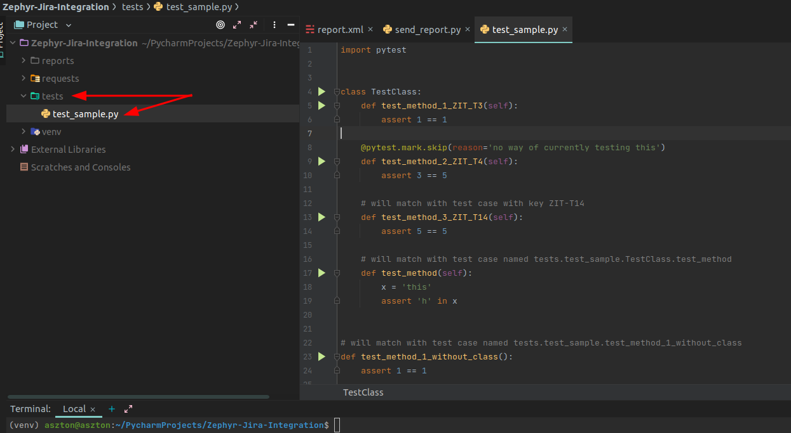
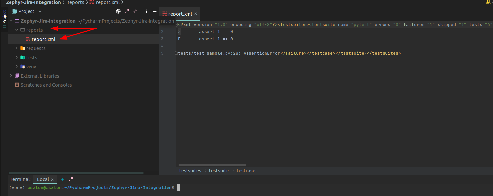
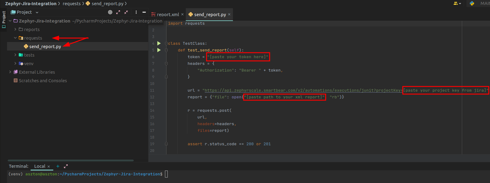
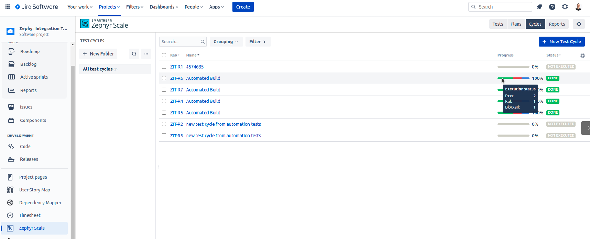

## How to integrate your automation tests with zephyr jira`s plugin:

### Steps to do this in general:
* Create xml report 
* Send xml report by post request to your jira project

##### This repository is a ready solution, so you can clone it, and just change some values like token etc.

### If you want to do it in your project, here is instruction:

Requirements:
* Python 3.x.x
* Pycharm IDE 
* Pytest
/
When you have installed python, pycharm and pytest package:

1. Create a ‘reports’ folder in the project.
2. Create a ‘tests’ folder and add to this folder a python file by this structure:\
test_[your test name].py\
its a required structure by pytest\


3. Create a test in pytest\
Here is example:
```ruby
import pytest

class TestClass:
    def test_method_1_ZIT_T3(self):
        assert 1 == 1

    @pytest.mark.skip(reason='no way of currently testing this')
    def test_method_2_ZIT_T4(self):
        assert 3 == 5

    # will match with test case with key ZIT-T14
    def test_method_3_ZIT_T14(self):
        assert 5 == 5

    # will match with test case named tests.test_sample.TestClass.test_method
    def test_method(self):
        x = 'this'
        assert 'h' in x


# will match with test case named tests.test_sample.test_method_1_without_class
def test_method_1_without_class():
    assert 1 == 1


def test_method_2_without_class_ZIT_T16():
    assert 1 == 0
}
```

4. Run tests, and generate xml report.
To do this please run this command:

##### pytest --junitxml=[your path to the reports folder]/report.xml

in my example on linux machine it is:
##### pytest --junitxml=/home/aszton/PycharmProjects/Zephyr-Jira-Integration/reports/report.xml

5. Check if xml report is created in ‘reports’ folder



6. Create a ‘requests’ folder, and add the python file ‘send report’

7. Add a POST request code to this file. Example code\

```ruby
import requests

class TestClass:
    def test_send_report(self):
        token = "[paste your token here]"
        headers = {
            "Authorization": "Bearer " + token,
        }

        url = "https://api.zephyrscale.smartbear.com/v2/automations/executions/junit?projectKey=[paste your project key from jira]"
        report = {"file": open("[paste path to your xml report]", "rb")}

        r = requests.post(
            url,
            headers=headers,
            files=report)

        assert r.status_code == 200 or 201
```
\
8. Run ‘send_report’ file and check if test cycle is updated in the zephyr jira`s plugin\


